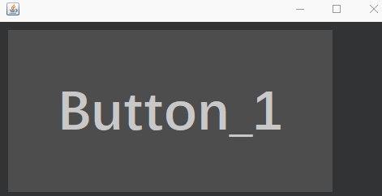
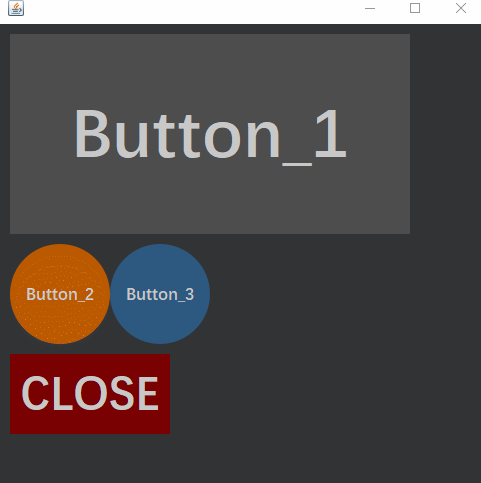
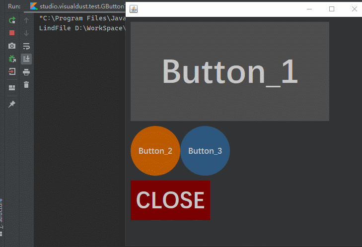
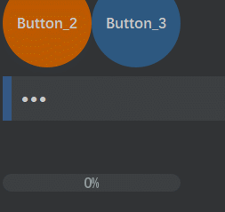

# Gwigets : totally new feeling of swing GUI

> Attention : this project is still building.

* To start with  
You need to initial the "FlavorResource" class before everything start, this method is a companion object, you can directly draw a call to it:  
```java
FlavorResource.Initialize()
```  
* Congratulations that you're almost there to start using it. Let's start with a GButton object:   
Oops, before the button , we need a frame first, right?
```kotlin
var stage = GStage()
stage.layout = null
stage.setSize(500, 600)
```
or in java:  
```java
GStage stage = new GStage()
stage.layout = null
stage.setSize(500, 500)
```  
Oops, I almostly forgot . Here wo use GStage as the container, witch you consider as the JFrame. Well, JFrame will be okay, too. but GStage will be a more powerful "frame-like-class" then as I will add some null-Layout auto size or auto align method.....

---   

so let's have a button then:
```kotlin
var button1 = GButton("Button_1")
button1.setLocation(10, 10)
button1.setSize(400, 200)
stage.add(button1)
```  
or in java:
```java
GButton button1 = new GButton("Button_1");
button1.setLocation(10, 10);
button1.setSize(400, 200);
stage.add(button1);
```  

---   

The last step is to set the frame on display:   
```kotlin
stage.isVisible = true
```   
or in java:
```java
stage.setVisable(true);
```   

---

* Well done. Let's see what happend:  
  
  


---  
   
* Actually we got many pattern on this GButton class. Such as change it's shape and type on creating it:
```kotlin
//kotlin code
var button2 = GButton(
    "Button_2",
    GButton.ButtonSeries.WARN_FEATURED
)
button2.setButtonShap(GButton.Shapes.oval)
button2.setLocation(10, 220)
button2.setSize(100, 100)
stage.add(button2)
var button3 = GButton(
    "Button_3",
    GButton.ButtonSeries.OK_FEATURED
)
button3.setButtonShap(GButton.Shapes.oval)
button3.setLocation(110, 220)
button3.setSize(100, 100)
stage.add(button3)
var button4 = GButton(
    "CLOSE",
    GButton.ButtonSeries.ERROR_FEATURED
)
button4.setLocation(10, 330)
button4.setSize(160, 80)
stage.add(button4)
```   
(Im too lazy to write the java demo part.)  
So, what is it ?  
  

---  
   
* Oh well well, I know you are waiting for the "Adding mouse listener" part. Actually there is no much difference from JButton:  

```kotlin
var gPasswordField = GpasswordField(Color(52, 88, 133))
gPasswordField.setLocation(10, 330)
gPasswordField.setSize(250, 50)
button4.addMouseListener(object :MouseAdapter() {
    override fun mouseClicked(e: MouseEvent?) {
        stage.remove(button4)
        stage.add(gPasswordField)
        gPasswordField.setPassword("123")
        stage.repaint()
    }
})
button1.addMouseListener(object:MouseAdapter(){
    override fun mouseClicked(e: MouseEvent?) {
        println(gPasswordField.getPassword())
    }
})
```  
Look at the result:  
   

---   

As you wish , we have some kinds of progress bar, too  
```kotlin
//kotlin code
var progressBar = GProgressBar(1, 100)
    progressBar.setSize(200, 20)
    progressBar.setLocation(10, 440)
//    progressBar.setValue(5)
    progressBar.textPainted = true
    stage.add(progressBar)
    button2.addMouseListener(object : MouseAdapter() {
        override fun mousePressed(e: MouseEvent?) {
            thread {
                for (i in 0..100) {
                    Thread.sleep(10)
                    progressBar.setValue(i)
                }
            }
        }
    })
```  
See what happened here:  

  

---
   
* But maybe you dont want to know that when you applying Gwights into your GUI, you have to use null layout.  
* Well , I havent finish this project yet.